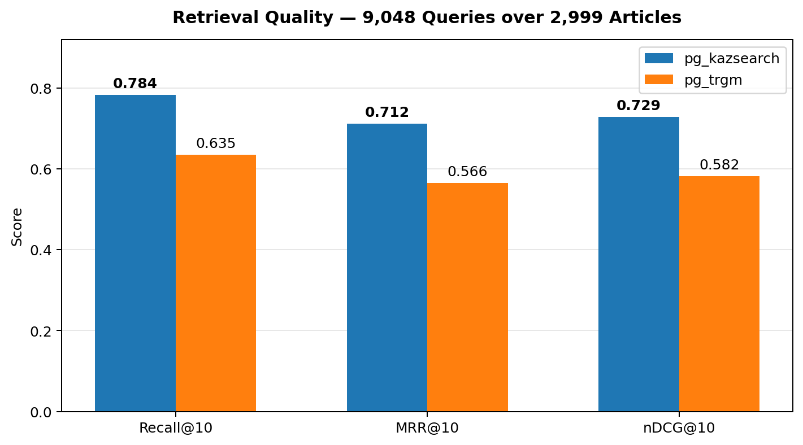
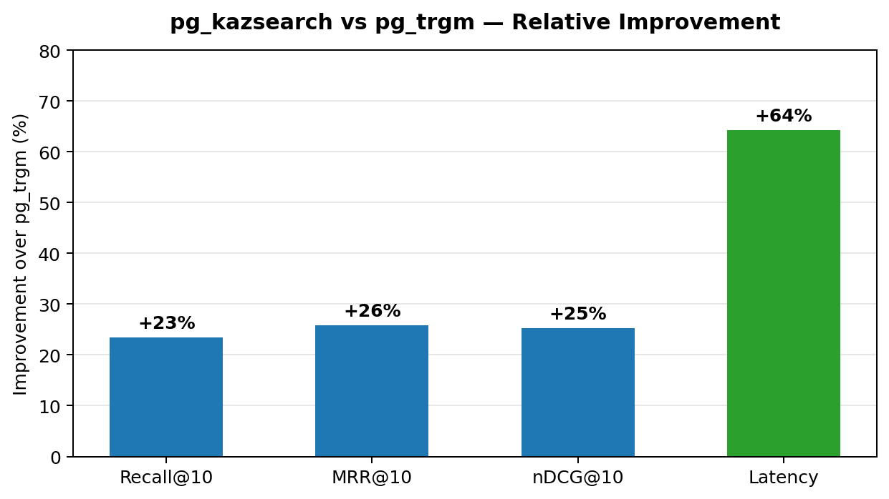
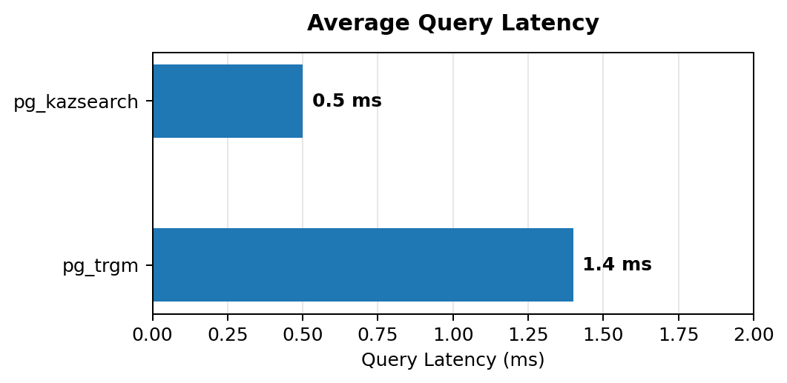

# pg_kazsearch

[License: LGPL v3](LICENSE)
[PostgreSQL: 16–18](https://www.postgresql.org/)

The first PostgreSQL full-text search extension for the Kazakh language.

Kazakh is heavily agglutinative: a single word like `мектептерімізде` carries plural, possessive, and locative suffixes that must all be stripped to reach the root `мектеп`. No existing PostgreSQL or Elasticsearch analyzer handles this. pg_kazsearch fills that gap with a Rust extension (via [pgrx](https://github.com/pgcentralfoundation/pgrx)) that plugs directly into PostgreSQL's text search pipeline.

```sql
CREATE EXTENSION pg_kazsearch;

SELECT to_tsvector('kazakh_cfg', 'президенттің жарлығы');
-- 'жарлық':2 'президент':1
```

---

## Install

### Pre-built package (Debian/Ubuntu)

Download the `.deb` for your PostgreSQL version from [GitHub Releases](https://github.com/darkhanakh/pg-kazsearch/releases):

```bash
# Example: PostgreSQL 18 on amd64
wget https://github.com/darkhanakh/pg-kazsearch/releases/latest/download/postgresql-18-pg-kazsearch_0.1.0_amd64.deb
sudo dpkg -i postgresql-18-pg-kazsearch_0.1.0_amd64.deb
```

Then in psql:

```sql
CREATE EXTENSION pg_kazsearch;
```

### Docker

Use the pre-built image as a drop-in replacement for `postgres`:

```yaml
# docker-compose.yml
services:
  db:
    image: ghcr.io/darkhanakh/pg-kazsearch:18
```

Or add to your existing Dockerfile:

```dockerfile
FROM ghcr.io/darkhanakh/pg-kazsearch:18 AS kazsearch
FROM postgres:18

COPY --from=kazsearch /usr/share/postgresql/18/extension/pg_kazsearch* /usr/share/postgresql/18/extension/
COPY --from=kazsearch /usr/lib/postgresql/18/lib/pg_kazsearch* /usr/lib/postgresql/18/lib/
COPY --from=kazsearch /usr/share/postgresql/18/tsearch_data/kaz_* /usr/share/postgresql/18/tsearch_data/
```

### From source

```bash
# Requires: Rust toolchain, cargo-pgrx, postgresql-server-dev
cargo install --locked cargo-pgrx --version "=0.17.0"
cargo pgrx init --pg18 $(which pg_config)

git clone https://github.com/darkhanakh/pg-kazsearch.git
cd pg-kazsearch
cargo pgrx install --release -p pg_kazsearch

# Install lexicon and stopwords
cp data/tsearch_data/kaz_stems.dict $(pg_config --sharedir)/tsearch_data/
cp data/tsearch_data/kaz_stopwords.stop $(pg_config --sharedir)/tsearch_data/
```

---

## Usage

The extension creates everything automatically — a text search template, dictionaries, and a ready-to-use configuration called `kazakh_cfg`:

```sql
CREATE EXTENSION pg_kazsearch;

-- Stem individual words
SELECT ts_lexize('pg_kazsearch_dict', 'алмаларымыздағы');
-- {алма}

-- Build tsvectors
SELECT to_tsvector('kazakh_cfg', 'мектептеріміздегі оқушылардың');
-- 'мектеп':1 'оқушы':2

-- Add FTS to a table
ALTER TABLE articles ADD COLUMN fts tsvector
    GENERATED ALWAYS AS (
        setweight(to_tsvector('kazakh_cfg', title), 'A') ||
        setweight(to_tsvector('kazakh_cfg', body), 'B')
    ) STORED;

CREATE INDEX idx_fts ON articles USING GIN (fts);

-- Search
SELECT title FROM articles
WHERE fts @@ websearch_to_tsquery('kazakh_cfg', 'президенттің жарлығы')
ORDER BY ts_rank_cd(fts, websearch_to_tsquery('kazakh_cfg', 'президенттің жарлығы')) DESC
LIMIT 10;
```

### Tuning weights

Penalty weights are tunable at runtime without restarting PostgreSQL:

```sql
ALTER TEXT SEARCH DICTIONARY pg_kazsearch_dict (w_deriv = 3.5, w_short_char = 100.0);
```

---

## Benchmarks

Tested on 2,999 Kazakh news articles with 9,048 evaluation queries:







| Metric        | pg_kazsearch | pg_trgm | Improvement |
| ------------- | ------------ | ------- | ----------- |
| Recall@10     | **0.784**    | 0.635   | +23%        |
| MRR@10        | **0.712**    | 0.566   | +26%        |
| nDCG@10       | **0.729**    | 0.582   | +25%        |
| Query latency | **0.5 ms**   | 1.4 ms  | 2.8x faster |

### Stemmer examples

| Input            | Output    | Stripped                       |
| ---------------- | --------- | ------------------------------ |
| мектептерімізде  | мектеп    | plural + possessive + locative |
| президенттерінің | президент | plural + possessive + genitive |
| өзгеруі          | өзгеру    | verbal noun possessive         |
| берді            | бер       | past tense                     |
| экономикалық     | экономика | derivational adjective         |

---

## Architecture

```
┌────────────────────────────────────────────────────┐
│                  Cargo Workspace                   │
│                                                    │
│  core/         Pure Rust stemmer (no PG deps)      │
│  pg_ext/       pgrx PostgreSQL extension           │
│  cli/          CLI tool (kazsearch)                │
│  elastic/      Elasticsearch plugin (planned)      │
└────────────────────────────────────────────────────┘
```

The stemmer algorithm:

- **BFS suffix stripper** — breadth-first search over layered morphological rules (predicate, case, possessive, plural, derivational for nouns; person, tense, negation, voice for verbs), with vowel harmony validation
- **Penalty scoring** — candidates scored by syllable count, suffix weakness, derivational depth, and lexicon hits
- **Lexicon** — 21,863 POS-tagged stems from [Apertium-kaz](https://github.com/apertium/apertium-kaz) for overstemming protection
- **Stem repair** — consonant mutation reversal (б→п, г→к, ғ→қ), vowel elision restoration, lexicon-based vowel append

---

## CLI

The `kazsearch` CLI works standalone without PostgreSQL:

```bash
cargo build -p kazsearch-cli --release

# Stem a word
kazsearch stem алмаларымыздағы
# алмаларымыздағы	алма

# Morphological analysis
kazsearch analyze мектептеріміздегі

# Benchmark
kazsearch bench wordlist.txt

# Validate lexicon
kazsearch lexicon validate data/tsearch_data/kaz_stems.dict
```

---

## Development

```bash
# Start dev environment
just up

# Build and install extension into running container
just build

# Reload extension (DROP + CREATE)
just reload

# Run core tests
just test-core

# Smoke test via SQL
just test-ext

# Build CLI
just cli
```

---

## Contributing

1. Fork the repo and create a feature branch
2. Make your changes — stemmer logic lives in `core/src/`, extension glue in `pg_ext/src/lib.rs`
3. Run `cargo test -p kazsearch-core --test stem_tests` to verify stemmer correctness
4. Run `just up && just reload && just test-ext` to verify the extension works end-to-end
5. Open a PR

Key things to know:

- Penalty weights in `core/src/explore.rs` are empirically tuned via CMA-ES — changing one can affect many test cases
- Layer guards encode real morphotactic constraints, not heuristics
- Vowel harmony (back/front) is mandatory for suffix validation

---

## References

- Krippes, K.A. (1993). *Kazakh (Qazaq-) Grammatical Sketch with Affix List*. ERIC.
- Washington, J., Salimzyanov, I., Tyers, F. (2014). *Finite-state morphological transducers for three Kypchak languages*. LREC.
- Makhambetov, O. et al. (2015). *Data-driven morphological analysis and disambiguation for Kazakh*. CICLing.

---

## License

- **Code:** [LGPL-3.0](LICENSE)
- **Lexicon data** derived from [Apertium-kaz](https://github.com/apertium/apertium-kaz) (GPL-3.0).

